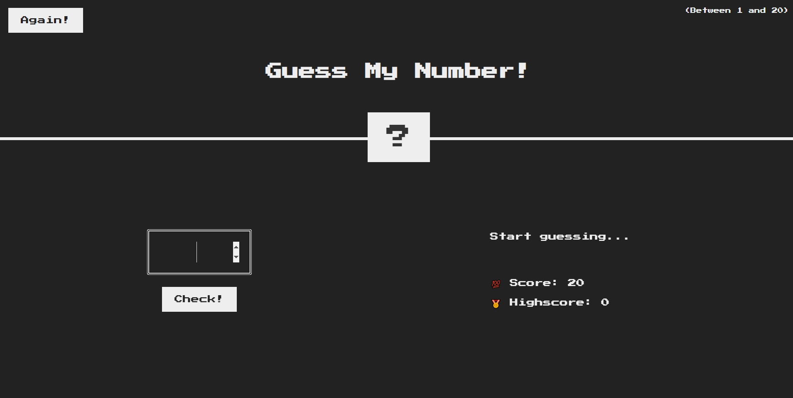
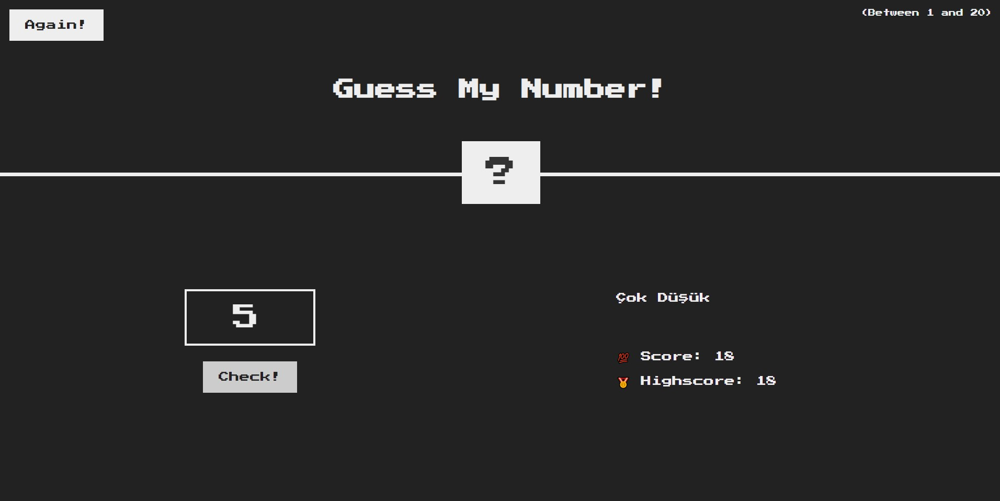

# Javascript DOM Intro Tutorial App

---

#   

---

## Course : Bilge Adam

## Instructor : Murat AKDAĞ

Project Link : [https://ziyacaylan.github.io/GuessMyNumber/](https://ziyacaylan.github.io/GuessMyNumber/)

## Used Technologies

- html
- css
- javascript

## Description

- The user is asked to guess a number between 1-20
- When the user enters own guess and presses the check button, if the guess is correct, the user wins the game
- If the prediction is high, it will receive the message too high and its score will be deducted by 1 point.
- If the prediction is low, it will receive a very low message and its score will be deducted by 1 point.
- when she wins the game, it is checked whether he/she has made the highest score
- If the user made the highest score, the highest score is updated.
- When the user presses the button again, the game restarts.

## Good Luck

## Some Screenshots Below

  
  

